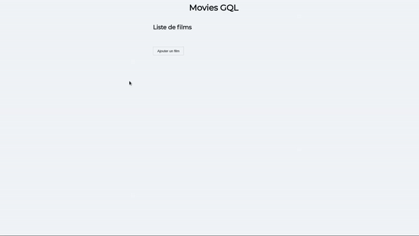

# Movies GQL

Découverte Apollo Client pour gestion des states, mise en place d'un serveur GraphQL directement connecté à une BDD MongoDB pour les datas.

- Ajouter/supprimer un film
- Consulter la fiche du film
- Ajouter une review
- Liker une review

Front: React, Apollo Client

Back: Node, Express, GraphQL, Mongoose



## Lancement

```
yarn

yarn dev
```

[L'app est disponible sur localhost:4000](http://localhost:4000/)
